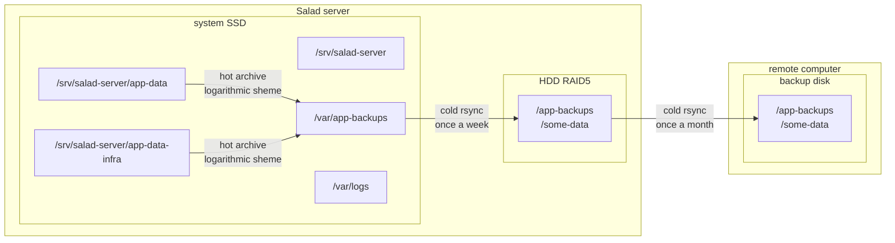
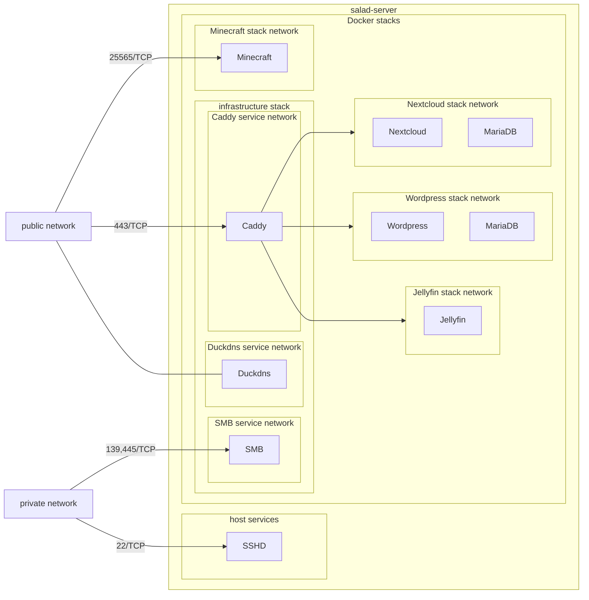

# Disclaimer

This is a work in progress and the first usable version is not yet available.

# Introduction

This project proposes the use of Docker stacks to host all the services of a home server. It provides configuration, backup and monitoring tools for the host, as well as reference Docker stacks for setting up predefined common services.
Included features:
- Software RAID5 with hot swap and automated spare support
- Automated backups of services data with recent versions history
- Automated updates for both host and Docker services
- Hardware and software monitoring with automated e-mail alert
- Automated DNS with subdomains and HTTPS support for web services
- SMB service for private network use
- Flexible and simple upgrades using Docker stacks

# Data architecture

# Network architecture

Each service has a reduced connection to the network, in particular:
- Excepted the Duckdns service, Docker services cannot access the internet.
- Web services must be accessed through the Caddy reverse-proxy, caddy is the only service to have an IP address in each web service stack network.

