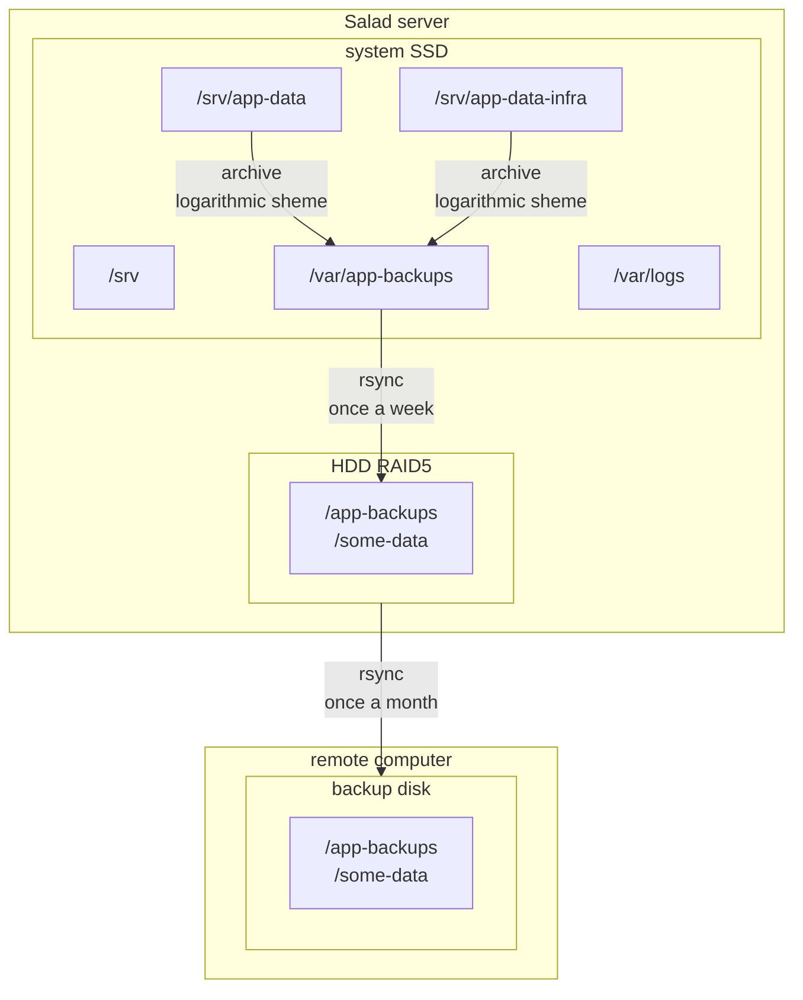

# Disclaimer

This is a work in progress and the first usable version is not yet available.

# About the project

This project proposes the use of Docker stacks to host all the services of a home server. It provides configuration, backup, security and monitoring tools for the host, as well as reference Docker stacks for setting up common services.

# Hardware architecture

