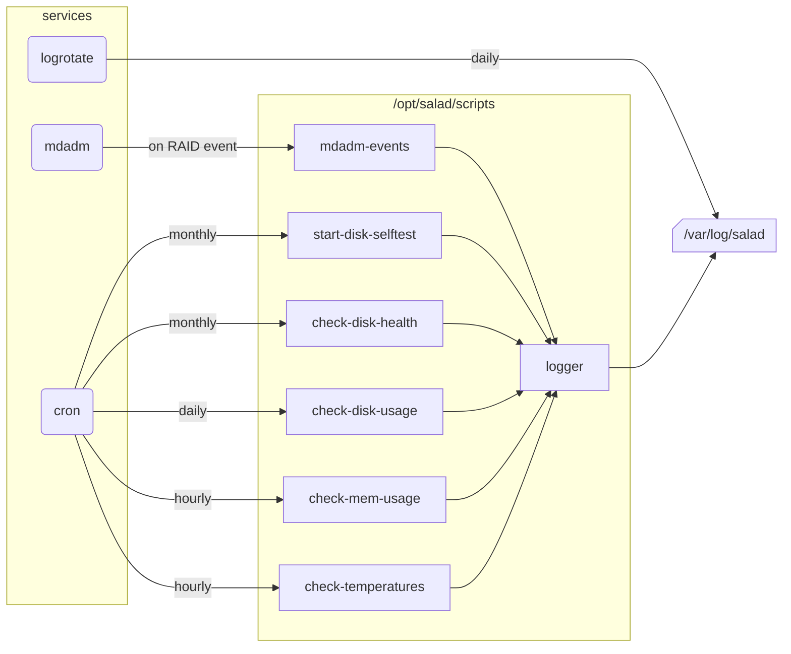

# Overview

| Script name             | Comment                                           | Parameters                    |
|-------------------------|---------------------------------------------------|-------------------------------|
| check-disk-health       | Reads SMART data of a disk to evaluate its health | Disk ID as in /dev/disk/by-id |
| check-disk-usage        | Check usage of every partitions                   |                               |
| check-mem-usage         | Check RAM and SWAP usage                          |                               |
| check-temperatures      | Check CPU and disks temperatures                  |                               |
| docker-cold-bkp-upgrade | Stops, backups, updates, restarts a docker stack  | Docker stack name             |
| docker-upgrade          | Updates, restarts a docker stack without backup   | Docker stack name             |
| mdadm-events            | Executed on RAID events, for logging              | Event, array, disk            |
| logger                  | Common script for logging handling                | Name, message, level          |

# Tweak

- Every script have a _Constants_ section where you can edit some settings (e.g. thresholds).
- All scripts are using the _logger_ script so you can tweak the logging strategy here.

# Routines

