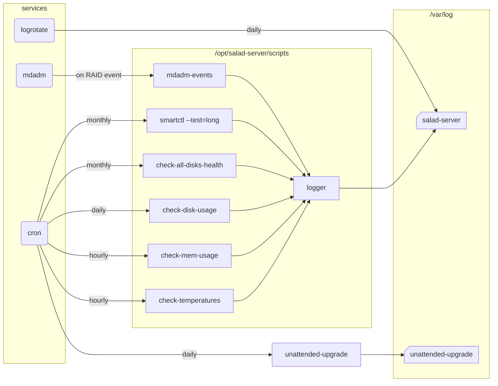

# Overview

| Script name                      | Comment                                             | Parameters                        |
|----------------------------------|-----------------------------------------------------|-----------------------------------|
| check_data_integrity_from_report | Checks coherence from a pair of integrity reports   | \<src_report\> \<dst_report\>     |
| check-all-disk-health            | Loops through all disks evaluating their healths    |                                   |
| check-disk-health                | Reads SMART data of a disk to evaluate its health   | \<device path\>                   |
| check-disk-usage                 | Checks usage of every partitions                    |                                   |
| check-mem-usage                  | Checks RAM and SWAP usage                           |                                   |
| check-temperatures               | Checks CPU and disks temperatures                   |                                   |
| create-data-integrity-report     | Hashes all files of a directory storing into a file | -d \<src dir\> -f \<report file\> |
| docker-cold-bkp-upgrade          | Stops, backups, updates, restarts a Docker stack    | [-u] \<Docker stack name\>        |
| logger_caller                    | Logger caller for python scripts                    |                                   |
| logger                           | Common script for logging handling                  | \<name\> \<message\> \<loglevel\> |
| mdadm-events                     | Executed on RAID events, for logging                | \<event\> \<array\> \<disk\>      |

# Tweak

- Every script have a _Constants_ section where you can edit some settings (e.g. thresholds).
- All scripts are using the _logger_ script so you can tweak the logging strategy here.

# Script behavior

## docker-cold-bkp-upgrade

1. Exports the existing Docker images in tar files in /tmp/salad-server
2. Downloads the newest Docker images if available
3. Stops the stack
4. Copies the persistent data in tar file to /tmp/salad-server
5. Starts the updated stack
6. Compresses the exported Docker images and data in the final archive in /mnt/data/salad-server

Here are the benefits of this lazy loading like strategy:
- Minimal downtime by combining backup and upgrade in the same script (only one restart)
- Minimal downtime caused only by steps 3 to 5 (no downtime for saving the Docker image, pulling the updates or backup compression)
- The persistent data is saved in a cold state, which is the most reliable way to save it
- The Docker image used at the date of the backup is also saved, which avoids rollback incompatibilities with newer images
- The backup is compressed, reducing the size on the disk

Expected downtime in the real world:
- For SMB, likely none, clients are not disconnected and can barely notice the update
- For Jellyfin, 30s to 2min depending on data migration update when restarting the service
- For Minecraft server, 30s to 2min depending on the map size

Options:
- -u | --only-on-upgrade ; Do not do anything if there is no upgrade available. Useful for stateless services (e.g. caddy, duckdns, samba)

```log
root@salade:/opt/salad-server# ./scripts/docker-cold-bkp-upgrade.sh minecraft
[2025-12-07 09:29:39 VERB]	Saving Docker image itzg/minecraft-server_ae17025022de -> /tmp/salad-server/minecraft_2025-12-07-09-29-39/docker_img_itzg_minecraft-server_ae17025022de.tar ...
[2025-12-07 09:29:49 VERB]	Pull newer images if available upgrade...
[+] Pulling 26/26
 ✔ minecraft Pulled                                                                                                                                                                      2.8s
   ✔ 20043066d3d5 Already exists                                                                                                                                                         0.0s
...
   ✔ ac060fbdec13 Pull complete                                                                                                                                                          1.2s
[2025-12-07 09:29:52 VERB]	Stopping the stack...
[+] Running 2/2
 ✔ Container minecraft        Removed                                                                                                                                                    0.7s
 ✔ Network minecraft_default  Removed                                                                                                                                                    0.4s
[2025-12-07 09:29:53 VERB]	Copying /opt/salad-server/docker/minecraft -> /tmp/salad-server/minecraft_2025-12-07-09-29-39/data.tar ...
[2025-12-07 09:29:56 VERB]	Starting the stack...
[+] Running 2/2
 ✔ Network minecraft_default  Created                                                                                                                                                    0.2s
 ✔ Container minecraft        Started                                                                                                                                                    0.3s
[2025-12-07 09:29:56 VERB]	Wait until the stack is healthy...
[2025-12-07 09:30:18 INFO]	itzg/minecraft-server restarted after upgrade ae17025022de -> 76f23f9b375c (downtime 26s).
[2025-12-07 09:30:18 VERB]	Archiving /tmp/salad-server/minecraft_2025-12-07-09-29-39 -> /mnt/data/salad-server/minecraft/minecraft_2025-12-07-09-29-39.tgz ...
[2025-12-07 09:32:08 INFO]	Backup archived /mnt/data/salad-server/minecraft/minecraft_2025-12-07-09-29-39.tgz (2.5G).
[2025-12-07 09:32:08 VERB]	Removing temporary data /tmp/salad-server/minecraft_2025-12-07-09-29-39 ...
[2025-12-07 09:32:08 VERB]	Removing unused Docker images...
Deleted Images:
untagged: itzg/minecraft-server@sha256:733ac299060597cf58b1cb0ae133010df50236eb7cd3de047fc3cfc9cb6e8494
...
deleted: sha256:f80b1469e98ea77bd9731cb463acb3f3c79d90e806b0348f90d886caec149e71

Total reclaimed space: 503.8kB
```

##  Health check scripts

```log
root@salade:/opt/salad-server# ./scripts/check-all-disks-health.sh
[2025-12-07 09:09:57 VERB]	/dev/sda detected as ST4000DM004-2CV104 WFN45B1F ATA
[2025-12-07 09:09:57 VERB]	/dev/sda SMART status OK
[2025-12-07 09:09:58 WARN]	/dev/sda last "Extended offline" selftest was 1939 > 1000 hours ago
[2025-12-07 09:09:58 VERB]	/dev/sda SMART selftest OK
[2025-12-07 09:10:00 WARN]	/dev/sda SMART bad worst attribute: 190 Airflow_Temperature_Cel 37 <= 40
[2025-12-07 09:10:02 VERB]	/dev/sda SMART attributes OK
[2025-12-07 09:10:02 INFO]	/dev/sda health OK
[2025-12-07 09:10:02 VERB]	/dev/nvme0 detected as KINGSTON SA2000M8250G 50026B76840FA3A3 NVMe
[2025-12-07 09:10:02 VERB]	/dev/nvme0 SMART status OK
[2025-12-07 09:10:02 VERB]	/dev/nvme0 SMART attributes OK
[2025-12-07 09:10:02 INFO]	/dev/nvme0 health OK
root@salade:/opt/salad-server# ./scripts/check-disk-usage.sh
[2025-12-07 09:10:14 INFO]	/ usage 10%
[2025-12-07 09:10:14 INFO]	/home usage 1%
[2025-12-07 09:10:14 INFO]	/opt usage 21%
[2025-12-07 09:10:14 INFO]	/tmp usage 1%
[2025-12-07 09:10:14 INFO]	/var usage 42%
[2025-12-07 09:10:14 INFO]	/boot/efi usage 7%
[2025-12-07 09:10:14 WARN]	/mnt/data usage 71% over 70%.
root@salade:/opt/salad-server# ./scripts/check-mem-usage.sh
[2025-12-07 09:10:19 INFO]	Mem usage 29%
[2025-12-07 09:10:19 INFO]	Swap usage 0%
root@salade:/opt/salad-server# ./scripts/check-temperatures.sh
[2025-12-07 09:10:33 INFO]	CPU temp 64
[2025-12-07 09:10:33 INFO]	Disk /dev/sda temp 30
[2025-12-07 09:10:33 INFO]	Disk /dev/sdb temp 37
[2025-12-07 09:10:33 INFO]	Disk /dev/sdc temp NaN (in standby)
[2025-12-07 09:10:33 INFO]	Disk /dev/sdd temp NaN (in standby)
[2025-12-07 09:10:33 INFO]	Disk /dev/nvme0 temp 32
```

# Routines



## Sample crontab

```bash
# Host security updates and restart if needed - everyday 3:30 AM
30 03 * * * /usr/bin/unattended-upgrade

# Disks SMART extended self-test - once a month 5:00 AM - expect 10h duration
00 05 01 * * /sbin/smartctl --test=long /dev/sda
00 05 02 * * /sbin/smartctl --test=long /dev/sdb
00 05 03 * * /sbin/smartctl --test=long /dev/sdc
00 05 04 * * /sbin/smartctl --test=long /dev/sdd

# Disks SMART health evaluation - once a month 5:00 AM
00 05 10 * * /opt/salad-server/scripts/check-all-disk-health.sh

# Disks usage - everyday 4:30 AM
30 04 * * * /opt/salad-server/scripts/check-disk-usage.sh

# Memory usage - Every hour
01 * * * * /opt/salad-server/scripts/check-mem-usage.sh

# Temperatures - Every hour
02 * * * * /opt/salad-server/scripts/check-temperatures.sh
```
