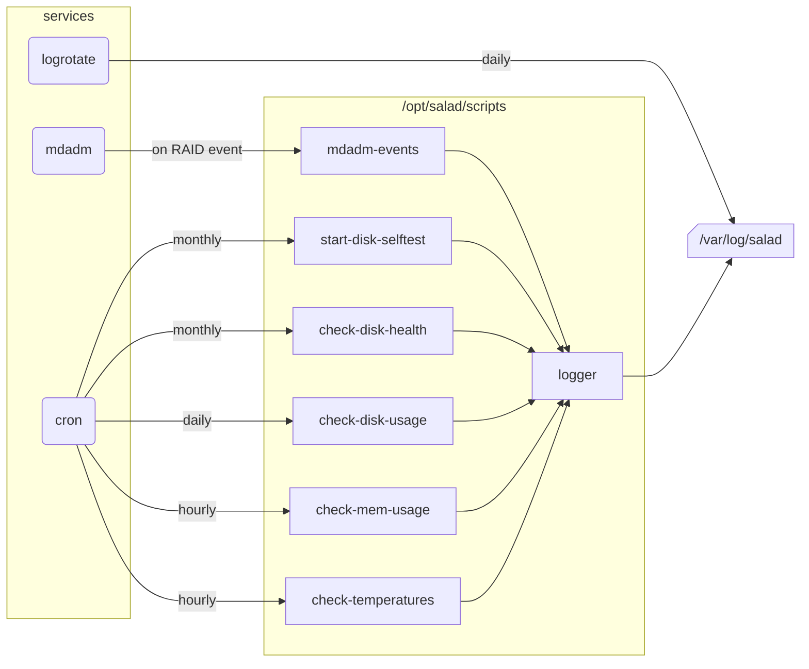

# Overview

| Script name                      | Comment                                             | Parameters                        |
|----------------------------------|-----------------------------------------------------|-----------------------------------|
| check_data_integrity_from_report | Checks coherence from a pair of integrity reports   | \<src_report\> \<dst_report\>     |
| check-all-disk-health            | Loops through all disks evaluating their healths    |                                   |
| check-disk-health                | Reads SMART data of a disk to evaluate its health   | \<device path\>                   |
| check-disk-usage                 | Checks usage of every partitions                    |                                   |
| check-mem-usage                  | Checks RAM and SWAP usage                           |                                   |
| check-temperatures               | Checks CPU and disks temperatures                   |                                   |
| create-data-integrity-report     | Hashes all files of a directory storing into a file | -d \<src dir\> -f \<report file\> |
| docker-cold-bkp-upgrade          | Stops, backups, updates, restarts a Docker stack    | \<Docker stack name\>             |
| logger_caller                    | Logger caller for python scripts                    |                                   |
| logger                           | Common script for logging handling                  | \<name\> \<message\> \<loglevel\> |
| mdadm-events                     | Executed on RAID events, for logging                | \<event\> \<array\> \<disk\>      |

# Tweak

- Every script have a _Constants_ section where you can edit some settings (e.g. thresholds).
- All scripts are using the _logger_ script so you can tweak the logging strategy here.

# Script behavior

## docker-cold-bkp-upgrade

1. Exports the existing Docker images in tar files in /tmp/salad-server
2. Downloads the newest Docker images if available
3. Stops the stack
4. Copies the persistent data in tar file to /tmp/salad-server
5. Starts the updated stack
6. Compresses the exported Docker images and data in the final archive in /mnt/data/salad-server

Here are the benefits of this lazy loading like strategy:
- Minimal downtime by combining backup and upgrade in the same script (only one restart)
- Minimal downtime caused only by steps 3 to 5 (no downtime for saving the Docker image, pulling the updates or backup compression)
- The persistent data is saved in a cold state, which is the most reliable way to save it
- The Docker image used at the date of the backup is also saved, which avoids rollback incompatibilities with newer images
- The backup is compressed, reducing the size on the disk

Expected downtime in the real world:
- For SMB, likely none, clients are not disconnected and can barely notice the update
- For Jellyfin, 30s to 2min depending on data migration update when restarting the service
- For Minecraft server, 30s to 2min depending on the map size

# Routines

